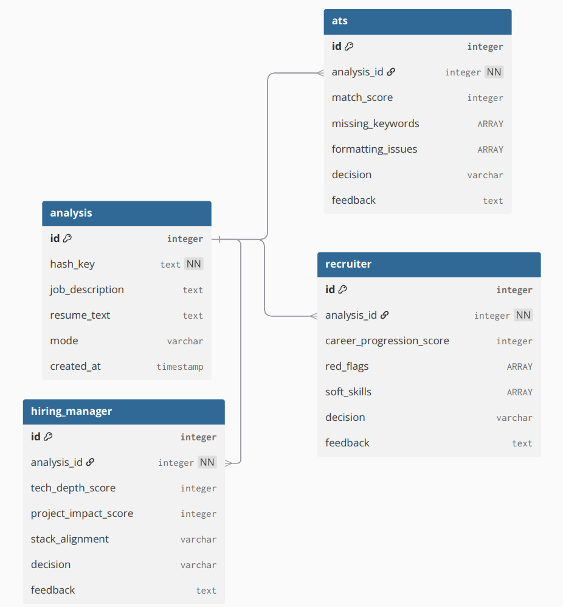

### Tables

#### Picture

1. analysis -> Store(ID, hashKey, JD, Rsume)
2. ats -> Store(ID, analysisId(FK), match_score, missing_keywords, fortmatting_issues, decision, feedback)
3. recruiter -> Store(ID, analysisId(FK), career_progresion_socre, red_flags, soft_skills, decision, feedback)
4. hiringmanager -> Store(ID, analysisId(FK), tech_depth_score, project_impact_score, stack_alignemt, decision, feedback)

### **Mental Model**

1. **Request Handling:**
* Generate a hash key for the incoming request.
* Check if the key exists in the database.

2. **Scenario A: Hash Key Exists (Cache Hit)**
* Skip Celery workers/background tasks.
* Fetch existing results from the database.
* Return the cached response immediately.

3. **Scenario B: Hash Key Not Present (Cache Miss)**
* Add a new entry to analysis table.
* **Trigger Workflow:** Instruct Celery workers to perform background tasks.
* **LLM Analysis:** The LLM performs analysis and generates results.
* **Storage (One-to-One Mapping):**
* ATS results->ATS Table.
* Recruiter results->Recruiter Table.
* Hiring Manager results->Hiring Manager Table.

* **Output:** Return the response in the format expected by the extension/wireframe.

#### To interactively connect to the database.

`docker exec -it mypostgres(docker image name) psql -U postgres`

#### To Quit the interactive mode
`\q`